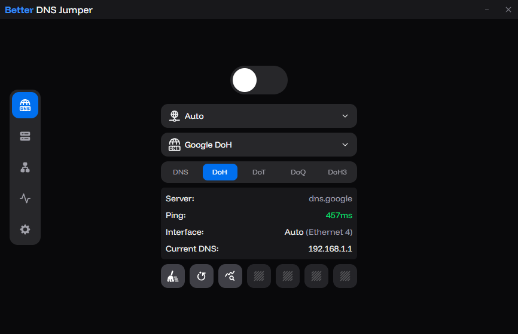

# Better DNS Jumper

A fast, modern DNS manager built with **Tauri (Rust + React)**. Switch DNS servers, manage network interfaces, and route queries through encrypted DNS protocols — all from a clean, lightweight interface.



## Installation

### Download

Grab the latest version from the **[Releases](https://github.com/Ho3einWave/better-dns-jumper/releases)** page.


## Features

* **Multi-Protocol DNS Support**

  * Traditional DNS (UDP/TCP)
  * DNS-over-HTTPS (DoH) — encrypted via HTTPS
  * DNS-over-TLS (DoT) — encrypted via TLS
  * DNS-over-QUIC (DoQ) — encrypted via QUIC
  * DNS-over-HTTP/3 (DoH3) — encrypted via HTTP/3
  * Local DNS proxy on `127.0.0.2:53` forwards queries to selected encrypted server

* **Server Management**

  * 30+ built-in servers from Cloudflare, Google, Quad9, AdGuard, ControlD, and more
  * Tabbed server browser with protocol filtering (All / DNS / DoH / DoT / DoQ / DoH3)
  * Search servers by name, address, or tag
  * Auto-ping with latency badges for all servers
  * Custom server support with per-protocol validation
  * Tag-based organization with chip input
  * Restore defaults to reset server list

* **Network Management**

  * View and select network interfaces
  * Auto-detect best interface
  * Set / clear DNS per interface

* **DNS Rules**

  * Custom DNS rules to block or redirect traffic
  * Useful for ad blocking and SNI proxy configurations

* **Tools**

  * Clear DNS cache
  * Reset DNS settings
  * DNS query logging
  * Auto-start on boot
  * Auto-update

* **UI**

  * Modern dark UI (React + HeroUI)
  * Smooth animations (Framer Motion)
  * Persistent window state


## Related Projects

### [cf-doh-worker](https://github.com/Ho3einWave/cf-doh-worker)

If you are looking for a **private, custom DNS-over-HTTPS (DoH) endpoint** to use with **Better DNS Jumper**'s DoH feature, check out the `cf-doh-worker` repository.

This project is a very minimalist DoH proxy designed to run on **Cloudflare Workers**. It allows you to:
* Quickly deploy your own private, highly-available DoH server.
* Use a DoH endpoint under your own domain to potentially bypass restrictions on known public DoH providers.

You can then configure the URL of your deployed Cloudflare Worker as a custom DoH server within the **Better DNS Jumper** application.


### Build from Source

```bash
git clone https://github.com/Ho3einWave/better-dns-jumper.git
cd better-dns-jumper
npm install    # or bun install
npm run tauri dev
npm run tauri build
```

## Usage

1. Launch the app (admin required)
2. Select a network interface (or use Auto)
3. Choose a protocol tab: **DNS**, **DoH**, **DoT**, **DoQ**, or **DoH3**
4. Pick a server
5. Toggle **Activate** to apply
6. Optional tools: clear cache, reset DNS, test server latency

## Technical Overview

* **Frontend**: React + TypeScript + Tailwind + HeroUI
* **Backend**: Rust (Tauri 2)
* **DNS Engine**: Hickory DNS (supports HTTPS, TLS, QUIC, and H3 resolvers)
* **Windows Integration**: IP Helper API + WMI
* **Proxy Mode**: Runs a local DNS proxy (`127.0.0.2:53`) that forwards queries to the selected encrypted DNS server (DoH/DoT/DoQ/DoH3)

Project structure:

```
src/             # React frontend
src-tauri/       # Rust backend
```

## Roadmap

- [ ] Improved error handling
- [x] Clean exit & automatic DNS restore
- [ ] Better logs & in-app log viewer
- [x] DNS-over-TLS / DNS-over-QUIC / DoH3
- [x] DNS rules for blocking/redirecting traffic
- [x] Server latency testing across all protocols
- [ ] Reduce WMI usage
- [ ] CLI support
- [ ] Multi-language support
- [ ] Syncable DNS profiles

## Contributing

PRs are welcome. For major changes, open an issue first.

## License

GPLv3 — see `LICENSE`.
