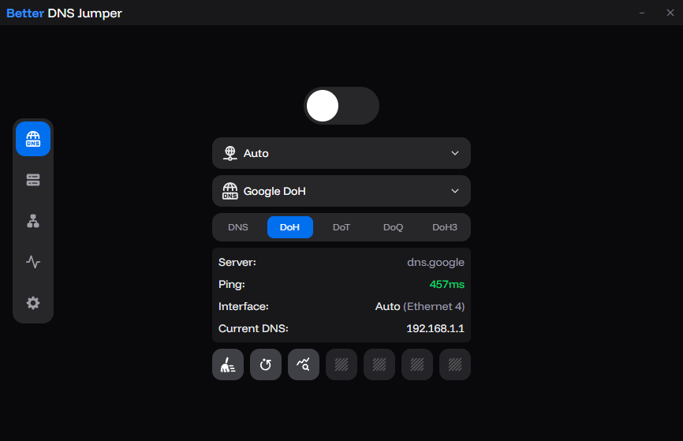

# Better DNS Jumper

A fast, modern DNS manager built with **Tauri (Rust + React)**. Switch DNS servers, manage network interfaces, and route queries through encrypted DNS protocols — all from a clean, lightweight interface.



## Installation

### Download

Grab the latest version from the **[Releases](https://github.com/Ho3einWave/better-dns-jumper/releases)** page.

### System requirements

**Windows 10 or newer (64-bit).** Administrator rights are required to change DNS
settings — Windows will prompt on launch.

| Windows version | Status |
| --- | --- |
| 10 build 18362 (1903) and newer, and 11 | Full support, including IPv6 leak protection |
| 10 build 10240 – 17763 (1507 – 1809, incl. LTSC 2019) | Works; IPv4-only DNS switching |
| 8.1 and older | Not supported |

Two separate limits are at work here.

**Why Windows 10 at all.** The Rust standard library links `ProcessPrng` and
`WaitOnAddress` into every binary built for the default `x86_64-pc-windows-msvc` target.
Those are Windows 10 and Windows 8 APIs respectively, and Windows resolves such imports
when it loads the executable — so on older systems the app cannot start at all. Reaching
Windows 7 would mean building against the tier-3 `x86_64-win7-windows-msvc` target.

**Why 1903 for IPv6.** Closing the IPv6 DNS leak needs `SetInterfaceDnsSettings`, added
in Windows 10 1903. The app resolves that function at runtime rather than importing it,
so older Windows 10 builds still launch and fall back to WMI — which can only configure
IPv4 name servers. On those systems a machine with IPv6 DNS keeps sending IPv6 queries to
its original resolver while the app is active. This is detected at startup and recorded
in the log.

The UI runs on Microsoft **WebView2**, preinstalled on Windows 11 and current Windows 10.
On older Windows 10 builds it may need installing separately.


## Features

* **Multi-Protocol DNS Support**

  * Traditional DNS (UDP/TCP)
  * DNS-over-HTTPS (DoH) — encrypted via HTTPS
  * DNS-over-TLS (DoT) — encrypted via TLS
  * DNS-over-QUIC (DoQ) — encrypted via QUIC
  * DNS-over-HTTP/3 (DoH3) — encrypted via HTTP/3
  * Local DNS proxy on `127.0.0.2:53` (UDP and TCP) forwards queries to the selected
    encrypted server, so truncated responses retry correctly
  * **IPv6 leak protection** — IPv6 name servers are redirected to the proxy too, instead
    of quietly continuing to reach your ISP's resolver

* **Server Management**

  * 30+ built-in servers from Cloudflare, Google, Quad9, AdGuard, ControlD, and more
  * Tabbed server browser with protocol filtering (All / DNS / DoH / DoT / DoQ / DoH3)
  * Search servers by name, address, or tag
  * Auto-ping with latency badges for all servers
  * Custom server support with per-protocol validation
  * Tag-based organization with chip input
  * Restore defaults to reset server list

* **Network Management**

  * View and select network interfaces
  * Auto-detect best interface, over IPv6 or IPv4
  * Set / clear DNS per interface
  * Enable / disable adapters
  * Instant reaction to network changes — plugging in a cable or switching Wi-Fi updates
    the UI immediately rather than on a timer
  * DNS is restored automatically on exit, and any leftover proxy address from an unclean
    shutdown is swept on the next launch

* **DNS Rules**

  * Custom DNS rules to block or redirect traffic
  * Useful for ad blocking and SNI proxy configurations

* **Tools**

  * Clear DNS cache
  * Reset DNS settings
  * DNS query logging
  * **Application log viewer** — searchable, level-filtered, with a live toggle; the same
    lines are written to a single rotating file for bug reports
  * Auto-start on boot
  * Auto-update

* **UI**

  * Modern dark UI (React + HeroUI)
  * Smooth animations (Framer Motion)
  * Persistent window state
  * Failures surface the actual reason rather than a generic message


## Related Projects

### [cf-doh-worker](https://github.com/Ho3einWave/cf-doh-worker)

If you are looking for a **private, custom DNS-over-HTTPS (DoH) endpoint** to use with **Better DNS Jumper**'s DoH feature, check out the `cf-doh-worker` repository.

This project is a very minimalist DoH proxy designed to run on **Cloudflare Workers**. It allows you to:
* Quickly deploy your own private, highly-available DoH server.
* Use a DoH endpoint under your own domain to potentially bypass restrictions on known public DoH providers.

You can then configure the URL of your deployed Cloudflare Worker as a custom DoH server within the **Better DNS Jumper** application.


### Build from Source

```bash
git clone https://github.com/Ho3einWave/better-dns-jumper.git
cd better-dns-jumper
npm install    # or bun install
npm run tauri dev
npm run tauri build
```

## Usage

1. Launch the app (admin required)
2. Select a network interface (or use Auto)
3. Choose a protocol tab: **DNS**, **DoH**, **DoT**, **DoQ**, or **DoH3**
4. Pick a server
5. Toggle **Activate** to apply
6. Optional tools: clear cache, reset DNS, test server latency

If something goes wrong, open **Application Logs** in the sidebar — it shows the same
content as the log file, and the "Open Folder" button takes you straight to it. Attaching
that file to a bug report is the single most useful thing you can do.

## Technical Overview

* **Frontend**: React + TypeScript + Tailwind + HeroUI
* **Backend**: Rust (Tauri 2)
* **DNS Engine**: Hickory DNS (supports HTTPS, TLS, QUIC, and H3 resolvers)
* **Windows Integration**: Win32 IP Helper and SetupAPI, with WMI only as a fallback on
  Windows 10 builds older than 1903
* **Proxy Mode**: Runs a local DNS proxy on `127.0.0.2:53` and `[::1]:53`, UDP and TCP,
  forwarding queries to the selected encrypted DNS server (DoH/DoT/DoQ/DoH3)
* **Logs**: `%TEMP%\better-dns-jumper\better-dns-jumper.log`, 5 MB per file, 3 kept

Project structure:

```
src/             # React frontend
src-tauri/       # Rust backend
```

## Roadmap

- [x] Improved error handling
- [ ] Add support for GoodbyeDPI or zapret or dpibreak
- [x] Clean exit & automatic DNS restore
- [x] Better logs & in-app log viewer
- [x] DNS-over-TLS / DNS-over-QUIC / DoH3
- [x] DNS rules for blocking/redirecting traffic
- [x] Server latency testing across all protocols
- [x] Reduce WMI usage
- [ ] CLI support
- [ ] Multi-language support
- [ ] Syncable DNS profiles

## Contributing

PRs are welcome. For major changes, open an issue first.

## License

GPLv3 — see `LICENSE`.
